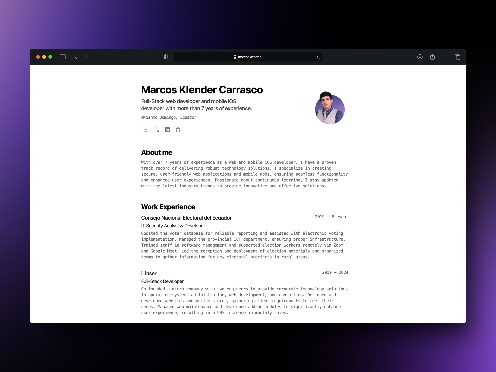

<div align="center">
 
<h2>
    Minimalist Printable Portfolio 
</h2>
<p>
CV JSON schema of <a href="https://jsonresume.org/schema/">jsonresume.org</a>
</p>

<p>
Based on the design of <a href="https://github.com/BartoszJarocki/cv">Bartosz Jarocki</a>
</p>

</div>

</img>

## 🛠️ Stack

- [**Astro**](https://astro.build/) - The new era web framework.
- [**Typescript**](https://www.typescriptlang.org/) - JavaScript with typing syntax.
- [**Ninja Keys**](https://github.com/ssleptsov/ninja-keys) - Dropdown menu with keyboard shortcuts made in pure JavaScript.

## 🚀 Empezar

### 1. Use this [repo](https://github.com/midudev/minimalist-portfolio-json) as _template_ of an Astro project:

- I use [pnpm](https://pnpm.io/installation) as dependency and package manager.

```bash
# Activate pnpm on MacOS, WSL & Linux:
corepack enable
corepack prepare pnpm@latest --activate

# Create your project:
pnpm create astro@latest -- --template midudev/minimalist-portfolio-json
```

### 2. Make it yours:

Edit the `cv.json` file to create your own printable resume.

### 3. Run the dev server:

```bash
# View your updates:
pnpm dev
```

1. Open [**http://localhost:4321**](http://localhost:4321/) in your browser to see your resume. 🚀

## 🧞 Commands

|     | Command         | Action                                                                       |
| :-- | :-------------- | :--------------------------------------------------------------------------- |
| ⚙️  | `dev` or `start` | Start the local development server in `localhost:4321`.                   |
| ⚙️  | `build`         | Check for possible errors and make a production package in `./dist/`. |
| ⚙️  | `preview`       | Make a local preview in `localhost:4321`                                       |

## 🔑 License

[MIT](LICENSE.txt) - Made by [**midudev**](https://midu.dev).
